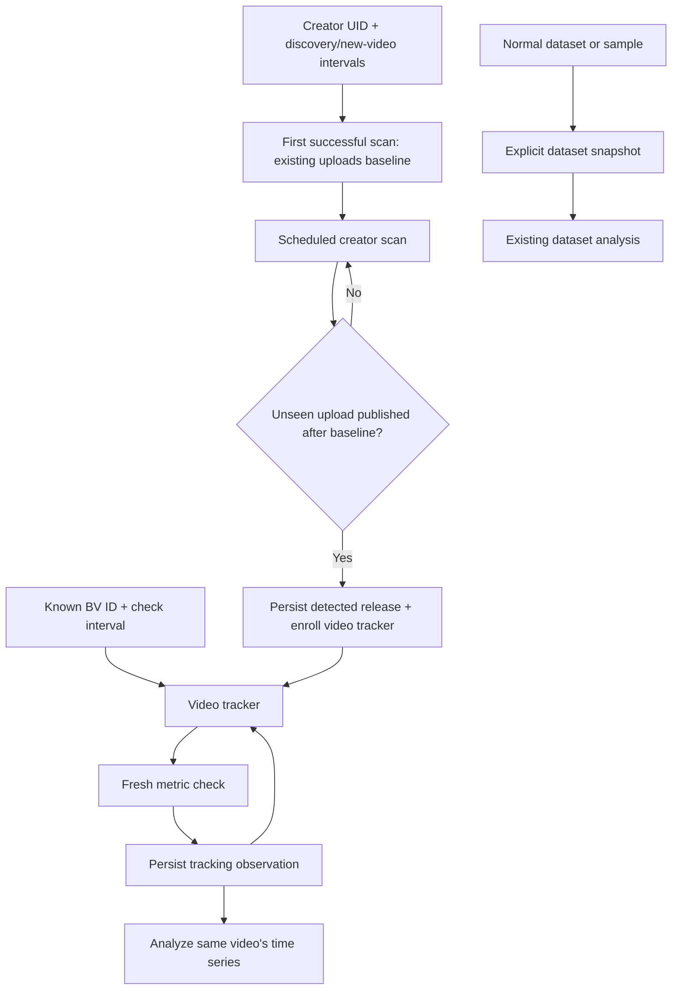

# Tracking workflow

| Workflow | Unit of data | Fetch strategy | Processing | Save policy |
| --- | --- | --- | --- | --- |
| Normal dataset + snapshot | A selected collection of videos | Creator range or sample collection | Existing dataset filters, distributions, ratios and charts | Explicitly save the whole loaded collection or a freshly collected result |
| Video tracking | One BV observed repeatedly | Fresh metric checks on its schedule | Changes and rates over actual observation time | Every successful tracking check persists one observation |
| Creator release watch | A creator's release stream | Periodic newest-first upload scans | Baseline/deduplication and release detection | Persist seen releases; enroll new videos for metric tracking |

The scheduled discovery loop continues after finding releases. Discovery does not
use counts from upload-list summaries as metric observations: the new video's
tracker performs a detail check to establish its own baseline. The displayed
discovery time is when a release was noticed; its publication time is separate.

For a selected metric `x` at consecutive successful observation times `t`:

- `delta = x_now - x_previous`
- `hours = (t_now - t_previous) / 3600`
- `rate_per_hour = delta / hours` when `hours > 0`
- `growth_percent = 100 * delta / x_previous` when `x_previous > 0`
- `rate_change = rate_now - rate_previous` when both adjacent rates are available
  and neither interval contains a counter decrease. This is a change in interval
  rates, not a time-normalized acceleration.
- `video_age_hours = (t_now - publication_time) / 3600`
- `net_change = latest_value - first_value`; overall average change/hour uses
  total elapsed time between the first and latest observations.

Null values stay unavailable and break the next adjacent comparison; zero is a
valid count. A negative change is retained and marked as a counter decrease.
Failures are separate events, so a later successful rate spans the actual gap.
Pauses and downtime do not produce estimated samples. Chart lines connect observed
endpoints, and rate charts show interval averages. This first version provides
descriptive growth analysis rather than forecasting or automatic anomaly alerts.

The creator's initial scan records up to 50 existing newest uploads as baseline
identities. Its successful scan time is the publication cutoff. Subsequent scans
can read up to 500 newest uploads, stopping at a known boundary or the initial
publication cutoff. Older uploads encountered later remain baseline records.
Failures do not advance the baseline or partially enroll trackers. A scan exceeding
the bound is reported as an error rather than silently accepting an incomplete
result. Checks use the active account on this Mac and the shared request pacing.

Pausing a release watch affects discovery only. Videos already enrolled keep their
own schedules; pause those video trackers separately. Existing trackers retain
their pause state and interval when also found by a release watch. Watches and
observations survive restart. Collection works while the browser is closed, as
long as the main server and computer remain running.

Each fetch closes its network clients and removes the SDK's session and settings
cache entries for that operation's event loop. Tracking observations remain in
SQLite rather than accumulating in the normal RAM dataset. History analysis
streams the stored observations, retaining only the requested chart window
(500 points by default, at most 5,000) while calculating the summary over the full
history. Creator discovery checks an indexed seen-video boundary instead of
loading every previously seen video into memory. Persisted history continues to
grow on disk; these bounds do not impose a retention policy or limit analysis time.

SQLite remains one file, with explicit independent membership for dataset batches
and tracking samples. Dataset-only rows cannot enter tracking analysis, CSV exports,
latest metric summaries or charts. Existing v1/v2 data migrates without deletion.
Use `collection_snapshot_rows` for dataset saves and `tracking_observations` /
`tracking_history` for monitoring in DB Browser.
